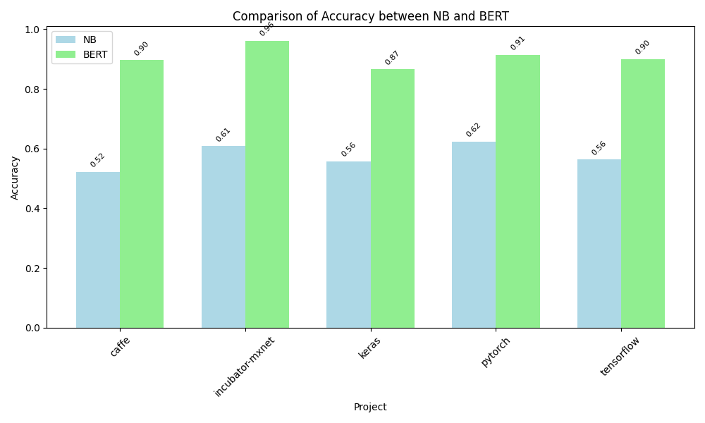
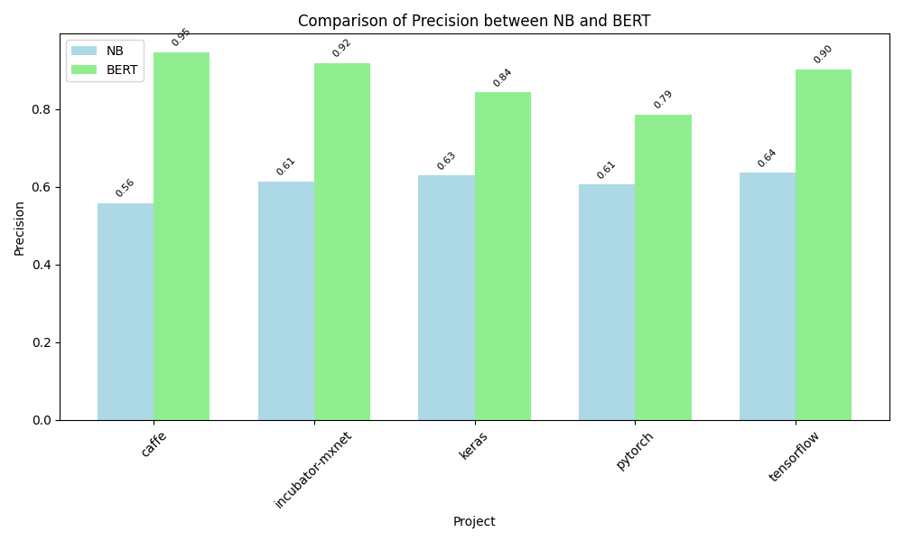
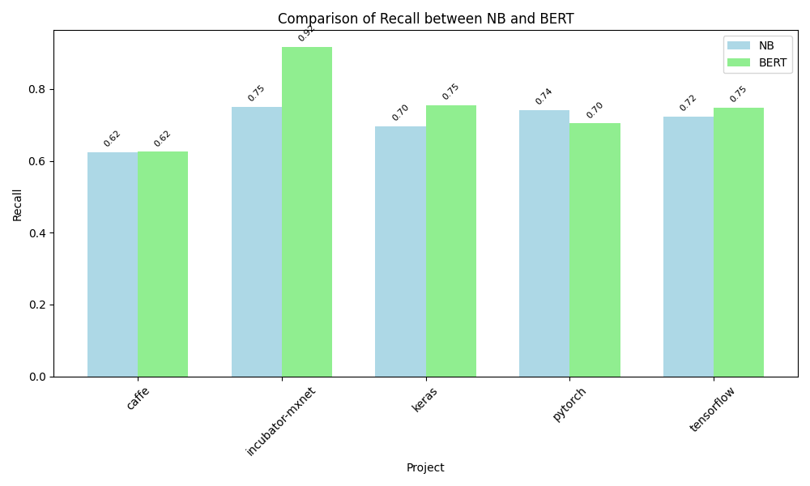
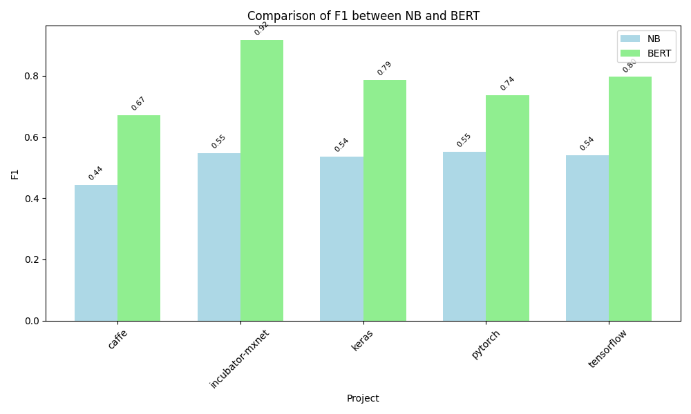

# Bug Report Classification

This repository contains a comprehensive implementation of bug report classification using both traditional machine learning (Naive Bayes) and deep learning (BERT) approaches. The project includes statistical analysis to compare the performance of these methods across different open-source projects.

## Project Overview

The project implements two different approaches for bug report classification:
1. Traditional ML approach using TF-IDF and Naive Bayes
2. Deep Learning approach using BERT (Bidirectional Encoder Representations from Transformers)

### Architecture


## Components

### 1. Traditional ML Classifier (`br_classification.py`)

This script implements a Naive Bayes classifier with TF-IDF features for bug report classification. It includes:
- Text preprocessing (HTML removal, emoji removal, stopword removal)
- TF-IDF feature extraction
- Naive Bayes classification
- Performance evaluation metrics

### 2. BERT-based Classifier (`BERT_br_classifier.py`)

This script implements a BERT-based classifier for bug report classification. Features include:
- Custom PyTorch Dataset for bug report data
- BERT model fine-tuning
- Training and evaluation pipelines
- Support for multiple projects

### 3. Statistical Analysis (`statistical_tests.py`)

This script performs statistical analysis to compare the performance of both approaches:
- Paired t-tests for different metrics (Accuracy, Precision, Recall, F1)
- Performance comparison across projects
- Statistical significance testing

## Results

The following visualizations show the comparison of performance metrics between Naive Bayes and BERT approaches:

### Accuracy Comparison


### Precision Comparison


### Recall Comparison


### F1 Score Comparison


## Usage

1. **Traditional ML Classification**:
```bash
python br_classification.py
```

2. **BERT-based Classification**:
```bash
python BERT_br_classifier.py
```

3. **Statistical Analysis**:
```bash
python statistical_tests.py
```

## Dependencies

- Python 3.x
- pandas
- numpy
- scikit-learn
- torch
- transformers
- nltk
- scipy

## Project Structure

```
.
├── br_classification.py      # Traditional ML implementation
├── BERT_br_classifier.py     # BERT-based implementation
├── statistical_tests.py      # Statistical analysis
├── datasets/                 # Dataset directory
├── Images/                   # Results and architecture diagrams
└── *.csv                     # Results files for different projects
```

## Results Files

The project generates several CSV files containing results for different projects:
- `NB_all_results.csv`: Results from Naive Bayes classifier
- `BERT_all_results.csv`: Results from BERT classifier
- Project-specific results (e.g., `tensorflow_NB.csv`, `pytorch_BERT.csv`, etc.)